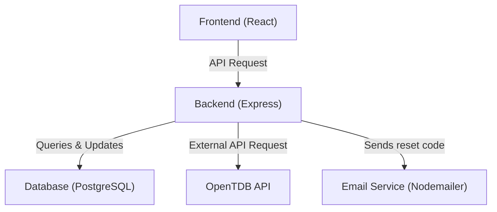

# Quiz App

A full-stack quiz application built with React, Express, and PostgreSQL. Designed as a personal project to explore web development and containerized environments, this repo allows you to run the app locally using Docker Compose for a consistent and reproducible setup.

## Features

### User Features
- **Play Quizzes:** Users can take multiple-choice quizzes with instant feedback.
- **Account Management:** Users can create an account and securely log in to access their quizzes and data.
- **Track Progress:** Quiz stats and scores are stored for each user.  
- **Dashboard Overview:** Recently completed quizzes are viewable on a personal dashboard. 

### Developer / Technical Features
- **External API Integration:** Uses the OpenTDB API to fetch quiz questions dynamically.  
- **Database Management:** Quiz data and user stats are stored and retrieved using PostgreSQL.  
- **Dockerized Local Development:** Frontend, backend, and database run in isolated containers for consistent setup and reproducibility.
- **Security:** Passwords are hashed for security, and password reset emails are verified using a unique code sent to the user's email.


## Tech Stack

- Frontend: React, Vite
- Backend: Express, Node
- Database: PostgreSQL
- Containerization: Docker, Docker Compose

## Architecture Diagram



## Setup / Installation (Local Development)

### Prerequisites
- **Docker**:
    - [Windows/macOS] Install Docker Desktop (https://www.docker.com/products/docker-desktop)
    - [Linux] Install Docker Engine + Docker Compose
    - Make sure Docker Desktop (or Docker Engine) is **running** before starting the app
- **Command-Line**
    - All setup commands are designed for **Bash**
    - [Windows] Use **Git Bash** - included with Git for Windows (https://git-scm.com/download/win)

### Get Started
1. Clone the repo
   ```bash
   git clone https://github.com/shamitsoni/quiz-app.git
   cd quiz-app
   ```
2. Configure environment variables  
   Copy the provided template and update with your database credentials and (optional) email service settings
   ```bash
   cp .env.example .env
   ```
4. Generate database schemas  
   Run the initialization script, to create init.sql and set the database owner with the PGUSER value from your .env
   ```bash
   ./gen-init.sh
   ```
5. Start services with Docker Compose  
   Build all containers (frontend, backend, and Postgres) and start the stack. For subsequent starts, exclude the --build flag
   ```bash
   docker-compose up --build
   ```
   - For subsequent runs, you may omit the --build flag unless changes were made to Dockerfiles.

6. Access local servers
   - Frontend: http://localhost:3000
   - Backend: http://localhost:5000


  
