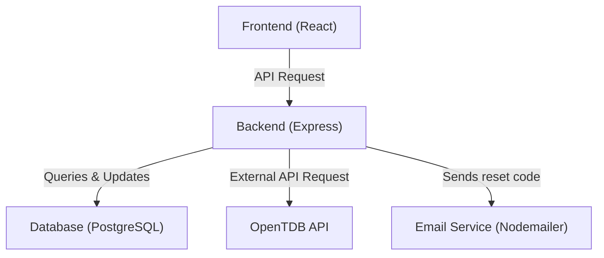

# Quiz App

A full-stack quiz application built with React, Express, and PostgreSQL. Designed as a personal project to explore web development and containerized environments, this repo allows you to run the app locally using Docker Compose for a consistent and reproducible setup.

## Features

### User Features
- **Play Quizzes:** Users can take multiple-choice quizzes with instant feedback.
- **Account Management:** Users can create an account and securely log in to access their quizzes and data.
- **Track Progress:** Quiz stats and scores are stored for each user.  
- **Dashboard Overview:** Recently completed quizzes are viewable on a personal dashboard. 

### Developer / Technical Features
- **External API Integration:** Uses the OpenTDB API to fetch quiz questions dynamically.  
- **Database Management:** Quiz data and user stats are stored and retrieved using PostgreSQL.  
- **Dockerized Local Development:** Frontend, backend, and database run in isolated containers for consistent setup and reproducibility.
- **Security:** Passwords are hashed for security, and password reset emails are verified using a unique code sent to the user's email.


## Tech Stack

- Frontend: React, Vite
- Backend: Express, Node
- Database: PostgreSQL
- Containerization: Docker, Docker Compose

## Architecture Diagram



## Setup / Installation (Local Development)

### Prerequisites
- Install [Docker Desktop](https://www.docker.com/products/docker-desktop) (Windows/macOS) **or** Docker Engine + Docker Compose on Linux.
- Make sure Docker Desktop (or Docker Engine) is **running** before starting the app.

1. Clone the repo:
   ```bash
   git clone https://github.com/shamitsoni/quiz-app.git
   ```
2. Navigate into the directory:
   ```bash
   cd quiz-app
   ```
3. Configure Environment Variables
   - Open the .env file in the root of the project
   - Configure postgres database details
   - (Optional) Add email details to configure Nodemailer and use reset password feature

4. Build and run using Docker Compose
   ```bash
   docker-compose up --build
   ```
5. Access local servers
   - frontend: http://localhost:3000
   - backend: http://localhost:5000


  
