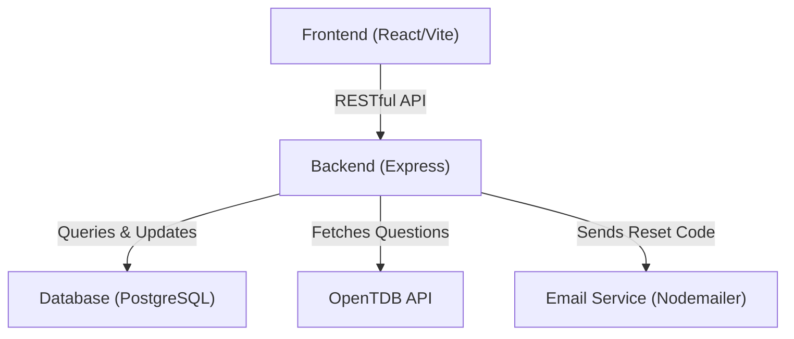
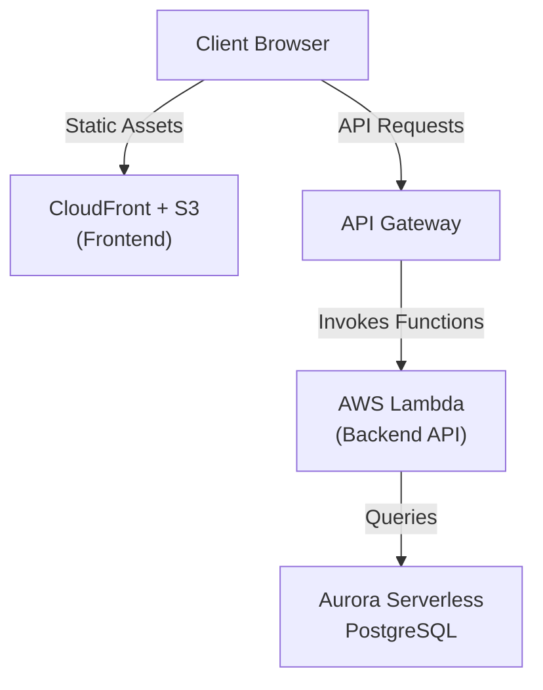

# Quiz App

A full-stack quiz application built with React, Express, and PostgreSQL, designed to demonstrate scalable web architecture, secure authentication, automated deployments, and production-grade performance testing.

The application runs locally via Docker Compose and is deployed using serverless architecture on AWS with an automated CI/CD pipeline.

## Features

### User Features
- Create an account, log in securely, and take quizzes.
- Instant feedback on answers.
- User dashboard showing quiz history + recent activity.
- Password reset flow via unique email verification code.

### Technical / Developer Features
- Integration with OpenTDB API for dynamic quiz generation.
- Hash-based authentication and input validation.
- Dockerized development (frontend, backend, database).
- CI/CD pipeline using GitHub Actions → AWS Lambda + S3 + CloudFront invalidation
- Load-tested API with 1000 req/sec sustained and <25ms average latency.

## Tech Stack
- Frontend: React, Vite
- Backend: Node.js, Express
- Database: PostgreSQL
- Containerization: Docker, Docker Compose

## Local Architecture (Docker Compose)

## Cloud Deployment Architecture (AWS)


## Project Structure
```
quiz-app/       
├── .github/
│   ├── workflows/        # GitHub Actions CI/CD
├── client/               # React Frontend (Vite)             
│   ├── src/
│   ├── Dockerfile
│   ├── index.html
├── server/               # Express Backend API        
│   ├── server.js
│   ├── Dockerfile
│   ├── package.json
├── .env
├── docker-compose.yml    # Container Orchestration (frontend + backend + Postgres)
└── README.md
```

## Local Setup (Docker Compose)

### Prerequisites
- Docker Desktop (Windows/Mac) or Docker Engine (Linux)
- Bash shell (Git Bash recommended on Windows)

### Get Started
1. Clone the repo
   ```bash
   git clone https://github.com/shamitsoni/quiz-app.git
   cd quiz-app
   ```
2. Configure environment variables  
   Copy the provided template and update with your database credentials and (optional) email service settings
   ```bash
   cp .env.example .env
   ```
4. Generate database schemas  
   Run the initialization script, to create init.sql and set the database owner with the PGUSER value from your .env
   ```bash
   ./gen-init.sh
   ```
5. Start services with Docker Compose  
   Build all containers (frontend, backend, and Postgres) and start the stack. For subsequent starts, exclude the --build flag
   ```bash
   docker-compose up --build
   ```
6. Access local servers
   - Frontend: http://localhost:3000
   - Backend: http://localhost:5000


  
